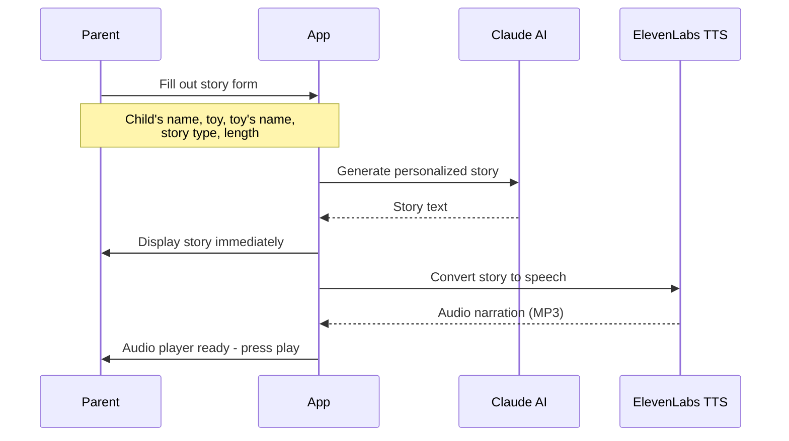
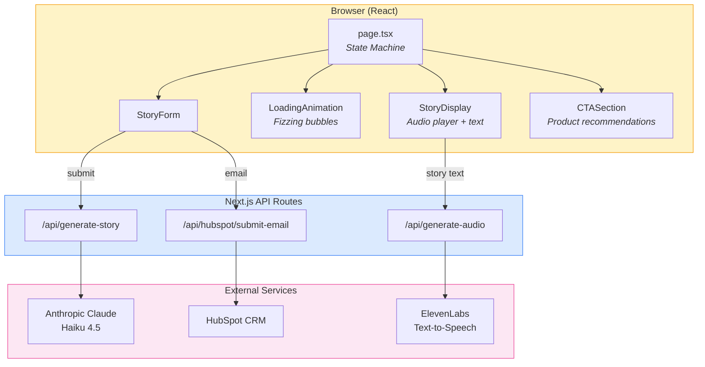
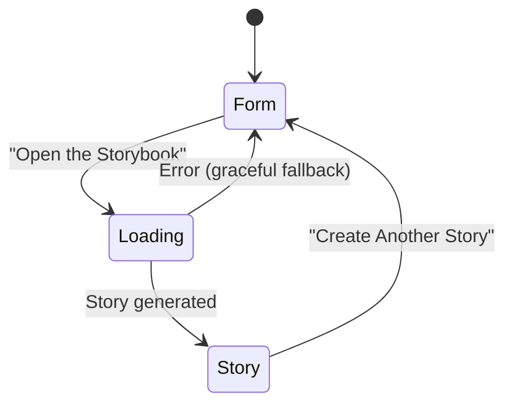
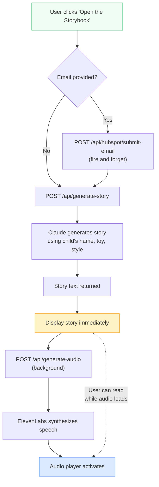

# BloomFizzy Magic Storybook

**An AI-powered bedtime story generator that turns bath time toys into narrated adventures.**

A kid cracks open a bath bomb, a little toy dolphin pops out, and ten minutes later they're tucked into bed listening to a fully narrated story about *their* dolphin named Captain Splash saving an underwater kingdom. That's this app.

---

## The Idea

[BloomFizzy](https://www.amazon.com/stores/BloomFizzy/page/08AE1239-24B7-48C4-81FF-37F0A7BD2E82) sells bath bombs for kids that have collectible toy characters hidden inside. 30 different animals across land and sea sets. We wanted to extend the magic beyond the bathtub -- so we built a tool that takes the toy a child just discovered and spins it into a personalized, AI-narrated bedtime story in under a minute.

The parent fills out a quick form (child's name, which toy they got, what they named it, story style), and the app chains together two AI services to produce a complete audio story. No accounts, no downloads, no friction. Just bath-to-bed magic.

## How It Works



The key UX decision: **show the story text instantly**, then load audio in the background. Nobody wants to stare at a loading screen while a 5-minute story gets synthesized. Parents can start reading aloud immediately, and the narration button lights up a few seconds later.

## Architecture



The whole thing is a single-page app with a three-state machine:



## The Story Engine

Claude Haiku generates stories using a "Master Storyteller" persona -- warm, slightly dramatic, the kind of voice you'd want narrating a bedtime story. Five story modes give it range:

| Mode | What It Does |
|------|-------------|
| **Rhythmic Rhyme** | AABB/ABAB rhyming verse, bouncy and musical |
| **Adventure** | Exploration, bravery, problem-solving |
| **Fairy Tale** | "Once upon a time..." with enchanted settings |
| **Bedtime Soother** | Moonlight, whispers, cozy feelings -- wind-down mode |
| **Onomatopoeia** | CRASH! ZOOM! SPLASH! -- pure sensory chaos for the energetic kids |

Every story weaves in the child's name as the hero, their toy as a loyal companion, and follows a complete narrative arc. Three length options: short (~1 min), medium (~2-3 min), or long (~5 min).

## The 30 Characters

Fifteen land animals and fifteen sea creatures, matching the physical toy lineup:

```
Land Animals          Sea Creatures
-----------          -------------
Unicorn              Dolphin
Dinosaur             Penguin
Owl                  Shark
Turtle               Jellyfish
Elephant             Seahorse
Lion                 Octopus
Giraffe              Whale
Bunny                Starfish
Bear                 Crab
Fox                  Sea Turtle
Monkey               Clownfish
Panda                Mermaid
Koala                Seal
Butterfly            Otter
Ladybug              Narwhal
```

## Tech Stack

| Layer | Tech | Why |
|-------|------|-----|
| Framework | **Next.js 16** (App Router) | Server-side API routes + React in one package |
| Styling | **Tailwind CSS** | Rapid iteration on a whimsical, gradient-heavy design |
| Story AI | **Anthropic Claude Haiku 4.5** | Fast, cheap, surprisingly good at children's stories |
| Narration | **ElevenLabs TTS** | Natural-sounding voice narration (Rachel voice) |
| Email/CRM | **HubSpot** | Capture parent emails for follow-up |
| Hosting | **Vercel** | Zero-config Next.js deployment |
| Language | **TypeScript** | Type safety across the full stack |

## How It Was Built

This entire app was built using [Claude Code](https://docs.anthropic.com/en/docs/claude-code) -- Anthropic's CLI agent for software development. The workflow looked like this:

1. **Started with a PRD** -- wrote out the product requirements (target audience, form fields, story generation specs, UI layout, brand guidelines) in a markdown doc
2. **Fed it to Claude Code** -- pointed the agent at the PRD and let it scaffold the Next.js project, wire up the API routes, and build out the components
3. **Iterated in conversation** -- tweaked the story prompts, adjusted the loading animation (the fizzing bath bomb effect went through a few rounds), refined the audio player UX
4. **Shipped to Vercel** -- deployed straight from the CLI

The whole thing came together in a single sitting. The PRD did most of the heavy lifting -- the more specific you are about what you want, the less back-and-forth you need with the agent.

## Project Structure

```
story_maker/
├── src/
│   ├── app/
│   │   ├── page.tsx              # Main page - state machine orchestrator
│   │   ├── layout.tsx            # Root layout, fonts, metadata
│   │   ├── globals.css           # Tailwind + custom gradients
│   │   └── api/
│   │       ├── generate-story/   # Claude story generation endpoint
│   │       ├── generate-audio/   # ElevenLabs TTS endpoint
│   │       └── hubspot/          # Email capture endpoint
│   ├── components/
│   │   ├── Header.tsx            # Brand header
│   │   ├── StoryForm.tsx         # Input form (name, toy, style, length)
│   │   ├── LoadingAnimation.tsx  # Fizzing bath bomb animation
│   │   ├── StoryDisplay.tsx      # Story text + audio player
│   │   ├── CTASection.tsx        # Product recommendations
│   │   └── EmailCollectionForm.tsx
│   └── lib/
│       └── constants.ts          # Characters, story types, lengths, links
├── PRD.md                        # Product requirements document
├── PRODUCT_OVERVIEW.md           # Brand and product details
└── package.json
```

## Getting Started

### Prerequisites

You'll need API keys for three services:
- [Anthropic](https://console.anthropic.com/) -- for story generation
- [ElevenLabs](https://elevenlabs.io/) -- for audio narration
- [HubSpot](https://www.hubspot.com/) -- for email capture (optional)

### Setup

```bash
# Clone and install
git clone <repo-url>
cd story_maker
npm install

# Configure environment
cp .env.example .env
# Edit .env with your API keys:
#   ANTHROPIC_API_KEY=sk-ant-...
#   ELEVENLABS_API_KEY=sk_...
#   HUBSPOT_APP_ACCESS_API_KEY=pat-... (optional)

# Run locally
npm run dev
```

Open [http://localhost:3000](http://localhost:3000) and make a story.

### Environment Variables

| Variable | Required | Description |
|----------|----------|-------------|
| `ANTHROPIC_API_KEY` | Yes | Claude API key for story generation |
| `ELEVENLABS_API_KEY` | Yes | ElevenLabs API key for audio narration |
| `HUBSPOT_APP_ACCESS_API_KEY` | No | HubSpot PAT for email capture |

## Request Flow (Detailed)

For the curious, here's what happens when you click "Open the Storybook":



The email submission is fire-and-forget -- it never blocks story generation. If HubSpot is down or unconfigured, the user never notices.

## License

MIT
